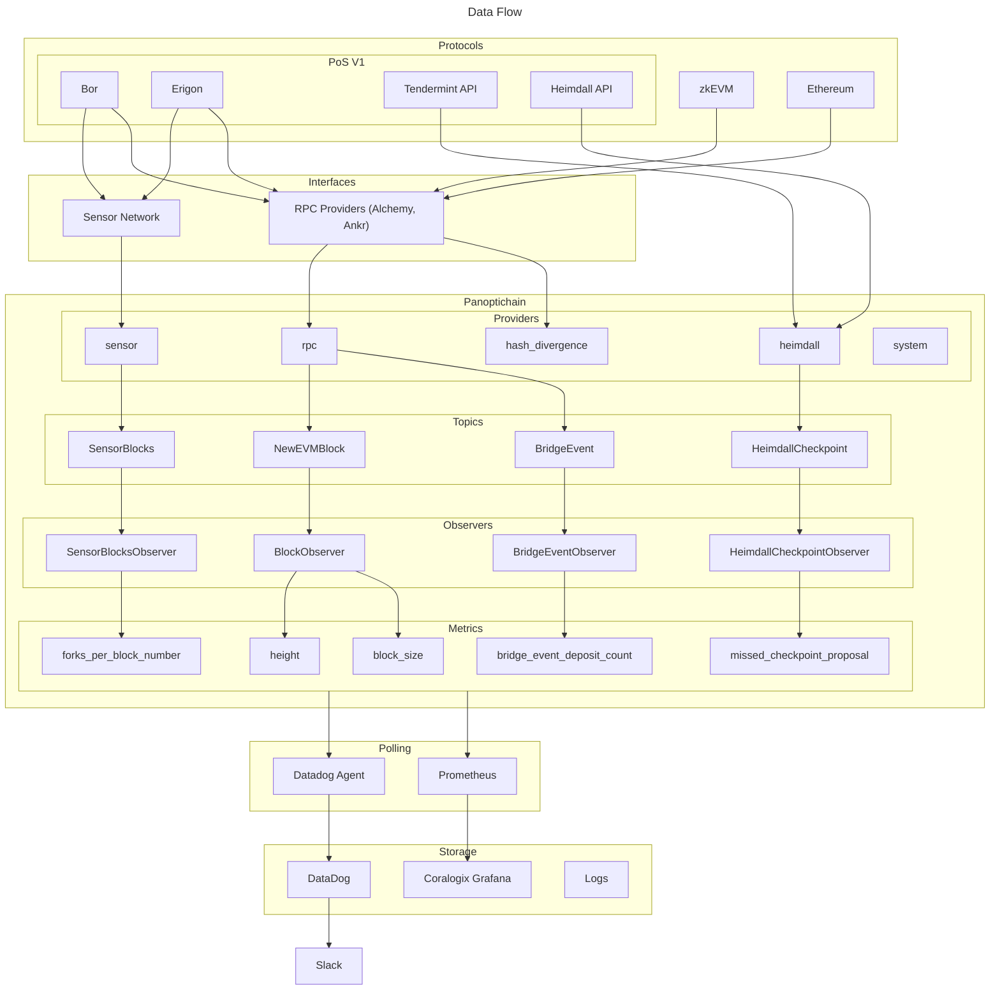
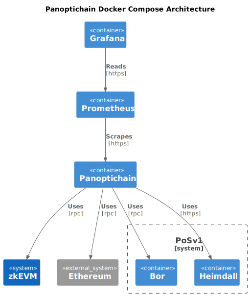
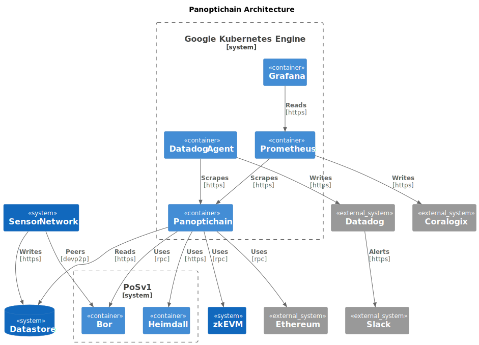
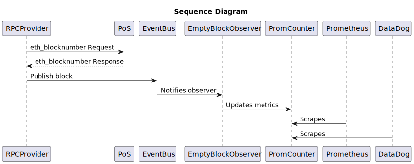
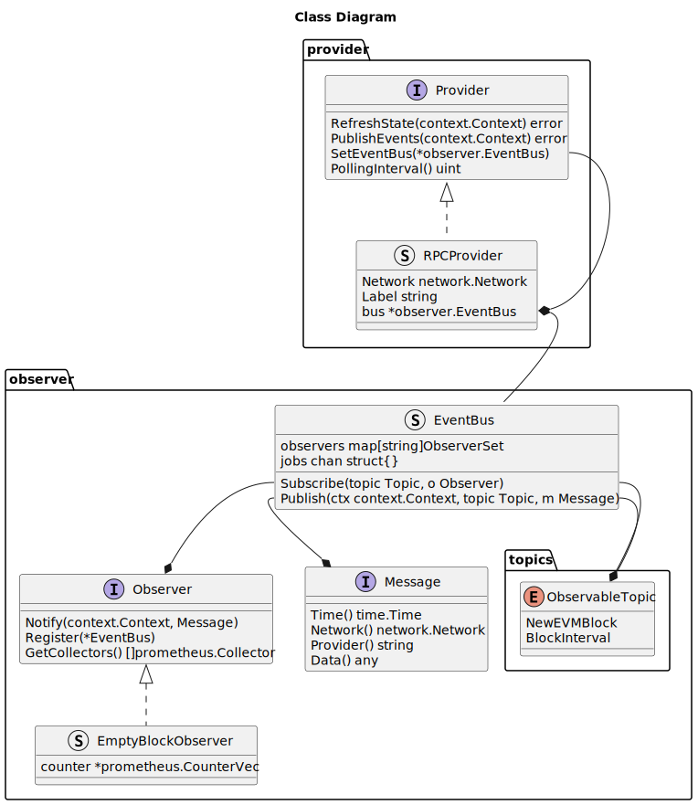

# Panoptichain Blockchain Monitoring


Panoptichain is a blockchain monitoring tool designed for observing on-chain
data and creating [Prometheus metrics](https://prometheus.io/docs/concepts/metric_types/).
The system utilizes a pub/sub pattern with providers, observers, and topics to
gather and process data. It is primarily built for monitoring Polygon blockchain
networks.

## Metrics

See [metrics.md](./metrics.md) for a complete set of all the metrics
Panoptichain could expose.

## Configuration

See [config.yml](./config.yml) for documentation of all of the configuration
options.

## Deployment

### Local

#### Building From Source

1. Run locally

   ```bash
   go run cmd/main.go
   ```

#### or

1. Build binary

   ```bash
   make
   ```

2. Start a local test chain

   ```bash
   ./scripts/start-local.sh
   ```

3. Start panoptichain

   ```bash
   ./out/panoptichain
   ```

4. Check the metrics

   ```bash
   curl localhost:9090/metrics
   ```

#### With Docker

1. Configure the [`config.yml`](./config.yml) to your liking. The container
   hasn't been configured to work with GCP so, the `sensor_network` providers
   should be commented out.

2. Start Panoptichain, Prometheus, and Grafana locally.

   ```bash
   docker compose up --build
   ```

3. Navigate to `http://localhost:3000`, and view the dashboard at **Home >
   Dashboard > Panoptichain**. Make sure to save any changes you want to keep
   by clicking the save dashboard button.

#### Docker Hub

1. Create a `docker-container` driver to allow for multi-platform builds.

   ```bash
   docker buildx create --name container --driver=docker-container
   ```

2. Build and push to Docker Hub.

   ```bash
   docker buildx build -t $USER/panoptichain:latest --platform=linux/amd64,linux/arm64 . --push --builder=container
   ```

### Production

1. Push a new version to GCP Artifact Registry.

   ```bash
   gcloud builds submit --tag "europe-west2-docker.pkg.dev/prj-polygonlabs-devtools-dev/container/panoptichain:$VERSION_TAG"
   ```

2. Deploy panoptichain and other services to GKE.

   ```bash
   gcloud auth login
   gcloud auth application-default login

   cd terraform/
   terraform apply
   ```

3. If only changing the config files, restart the deployments.

   ```bash
   kubectl rollout restart deployment panoptichain -n default
   kubectl rollout restart deployment panoptichain-cdk -n default
   ```

## Runbook

### Generated Files

- Install `stringer` and generate `go` files

  ```bash
  go install golang.org/x/tools/cmd/stringer@latest

  go generate ./...
  ```

- Generate the [`metrics.md`](./metrics.md) file

  ```bash
  make -B metrics.md
  ```

- Generate PlantUML diagrams

  ```bash
  cd docs/
  plantuml *.puml -svg
  ```

- Install `abigen` and generate contract ABI `go` bindings

  ```bash
  go install github.com/ethereum/go-ethereum/cmd/abigen@latest

  abigen --abi ValidatorSet.abi.json --pkg contracts --type ValidatorSet > ValidatorSet.go
  abigen --abi StateReceiver.abi.json --pkg contracts --type StateReceiver > StateReceiver.go
  abigen --abi StateSender.abi.json --pkg contracts --type StateSender > StateSender.go
  abigen --abi RootChain.abi.json --pkg contracts --type RootChain > RootChain.go
  abigen --abi ERC20.abi.json --pkg contracts --type ERC20 > ERC20.go
  abigen --abi PolygonZkEVMGlobalExitRootV2.abi.json --pkg contracts --type PolygonZkEVMGlobalExitRootV2 > PolygonZkEVMGlobalExitRootV2.go
  abigen --abi PolygonZkEVMGlobalExitRootL2.abi.json --pkg contracts --type PolygonZkEVMGlobalExitRootL2 > PolygonZkEVMGlobalExitRootL2.go
  abigen --abi PolygonZkEVMBridge.abi.json --pkg contracts --type PolygonZkEVMBridge > PolygonZkEVMBridge.go
  abigen --abi PolygonZkEVMBridgeV2.abi.json --pkg contracts --type PolygonZkEVMBridgeV2 > PolygonZkEVMBridgeV2.go
  abigen --abi PolygonZkEVMUpgraded.abi.json --pkg contracts --type PolygonZkEVMUpgraded > PolygonZkEVMUpgraded.go
  abigen --abi PolygonZkEVMEtrog.abi.json --pkg contracts --type PolygonZkEVMEtrog > PolygonZkEVMEtrog.go
  abigen --abi PolygonRollupManager.abi.json --pkg contracts --type PolygonRollupManager > PolygonRollupManager.go
  ```

## Architecture

### Data Flow



### System Architecture

When running with the locally with [`docker-compose.yml`](./docker-compose.yml), the architecture will look something like:



When running in production, it may look something closer to:



### Sequence Diagram



### Class Diagram



## Contributing

If you would like to add your own custom metrics, this section covers some of
the different components of Panoptichain that you may need to understand and
modify. At a high level, Panoptichain is a pub/sub pattern with providers,
observers, and topics.

### Observers

Observers are meant to be a dumb and stateless abstraction. Their sole purpose
to subscribe to a topic and update a Prometheus metric whenever they get
notified of a new message. All observers implement the `Observer` interface. If
you wanted to add an observer that counts the number of blocks of empty blocks,
here's how you would do it:

```go
// ./observer/rpc.go

// EmptyBlockObserver is the struct that should implement the Observer
// interface. It should contain the Prometheus metrics that will be used in the
// observer.
type EmptyBlockObserver struct {
	counter *prometheus.CounterVec
}

// Register subscribes to the NewEVMBlock topic and initializes the counter
// metric.
func (o *EmptyBlockObserver) Register(eb *EventBus) {
	eb.Subscribe(topics.NewEVMBlock, o)
	o.counter = metrics.NewCounter(
		metrics.RPC,
		"empty_block",
		"The total number of empty blocks observed",
		"signer_address",
	)
}

// Notify is called whenever there is a new message from a topic that the
// observer is subscribed to.
func (o *EmptyBlockObserver) Notify(ctx context.Context, m Message) {
	block := m.Data().(*types.Block)
	txs := block.Transactions()
	if len(txs) == 0 {
	    // Increment the empty block counter.
		o.counter.WithLabelValues(m.Network().GetName(), m.Provider()).Inc()
	}
}

// GetCollectors returns the Prometheus collectors in order to create the
// metrics.md file.
func (o *EmptyBlockObserver) GetCollectors() []prometheus.Collector {
	return []prometheus.Collector{o.counter}
}
```

You would also need to update the `observersMap` and the `config.yml` file.

```go
// ./observer/observer.go
var observersMap = map[string]Observer{
	"empty_block": new(EmptyBlockObserver),
}
```

```yaml
observers:
  - "empty_block"
```

For each observer, there only exists one instance of it running. For example,
there is only one `EmptyBlockObserver` initialized during runtime. You might
wonder how metrics are produced for different networks are done by one observer.
This is done by having different tags. By default, each metric has a `provider`
and a `network` tag, but you can add as many as you like, just be sure that the
field you add has a finite domain. For the `EmptyBlockObserver` it has an
additional `signer_address` tag, but since there's a (relatively) finite number
of validators this is fine. Something that wouldn't be suitable as a tag would
be a block number, which scales to infinity.

### Topics

Topics are the intermediary between providers and observers. Providers will send
messages to a specific topics and these messages will be received by observers
that subscribe to said topics. Generally, if you need to send a different data
type to an observer, then a new topic should be created. Here's how to go about
doing that:

```go
// ./observer/topics/topics.go

const (
	NewEVMBlock ObservableTopic = iota // *types.Block
	...
	NewTopic // *observer.NewTopicDataType
)
```

Make sure you leave a comment on what data type should be sent in the message to
that given topic. To regenerate `./observer/topics/observabletopic_string.go`
run `go generate ./...` from the project root.

### Providers

Providers are the main components that are fetching data. They handle all state
storage and requests to data sources. There are currently three types of
providers: [RPC](./provider/rpc.go), [Heimdall](./provider/heimdall.go),
and [Sensor](./provider/sensor.go). These providers will query data from their
respective data sources and send them to an [ObservableTopic](./observer/topics/topics.go).

All providers implement the `Provider` interface, and creating a provider is a
little more involved than an observer. Before creating one, make sure that the
provider is fetching data from a new data source that doesn't overlap with any
of the already existing providers. See [`provider.go`](./provider/provider.go)
for more help with implementation.

Providers require some configuration changes so be sure to update the `config`
struct in [`config.go`](./config/config.go) and the [`config.yml`](./config.yml)
file. You'll also need to initialize the new providers in the `Init` function in
[`runner.go`](./runner/runner.go).

## License

Copyright (c) 2024 PT Services DMCC

Licensed under either:

- Apache License, Version 2.0, ([LICENSE-APACHE](./LICENSE-APACHE) or <http://www.apache.org/licenses/LICENSE-2.0>), or
- MIT license ([LICENSE-MIT](./LICENSE-MIT) or <http://opensource.org/licenses/MIT>)

as your option.

The SPDX license identifier for this project is `MIT` OR `Apache-2.0`.
